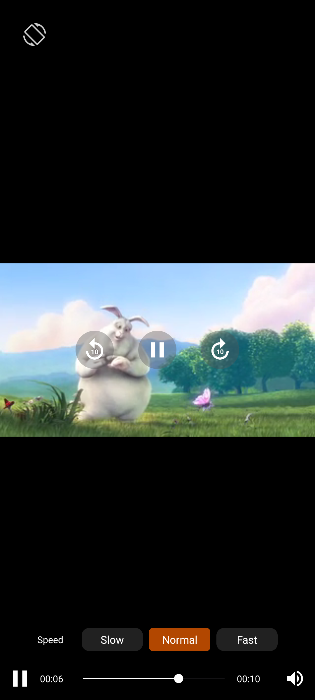

# 🎬 Android Media3 Custom Player UI – Build Your Own Media Player

An open-source **Android media player** app built using **Jetpack Media3** (successor to ExoPlayer), with a fully **custom user interface** for video and audio playback. Ideal for developers looking to integrate a personalized media player in their apps.

---

## 📸 Preview – Custom Media Player UI in Action


<!-- Inside README.md -->
<h2>📸 Screenshot</h2>




---

## 🔍 Why Use This Project?

If you're searching for:

- ✅ A **custom UI media player** for Android
- ✅ A working **Media3 player implementation**
- ✅ A modern **Media player UI**
- ✅ How to customize **ExoPlayer/Media3 controls**
- ✅ How to build an **Android video/audio player** with Media3

Then this open-source project is exactly what you need.

---

## 🚀 Features

- 🎥 Full support for **audio and video playback**
- 🧩 Built with **Jetpack Media3** and **Kotlin**
- 🖌️ Fully **customizable UI** (XML-based)
- 🔄 Supports **lifecycle-aware playback**
- 🌐 **Stream from remote or local URIs**
- 💡 Easy integration into existing projects

---

## 🧱 Built With

| Technology       | Details                             |
|------------------|-------------------------------------|
| Media3           | Android's latest media library      |
| Kotlin           | Modern, expressive JVM language     |
| XML              | UI for Android       |
| Android SDK      | Version 24+                         |

---

## 🛠️ Getting Started

Clone and run:

```bash
git clone https://github.com/your-username/media3-custom-player-ui.git
cd media3-custom-player-ui
